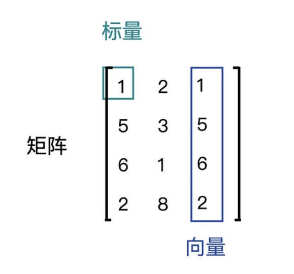
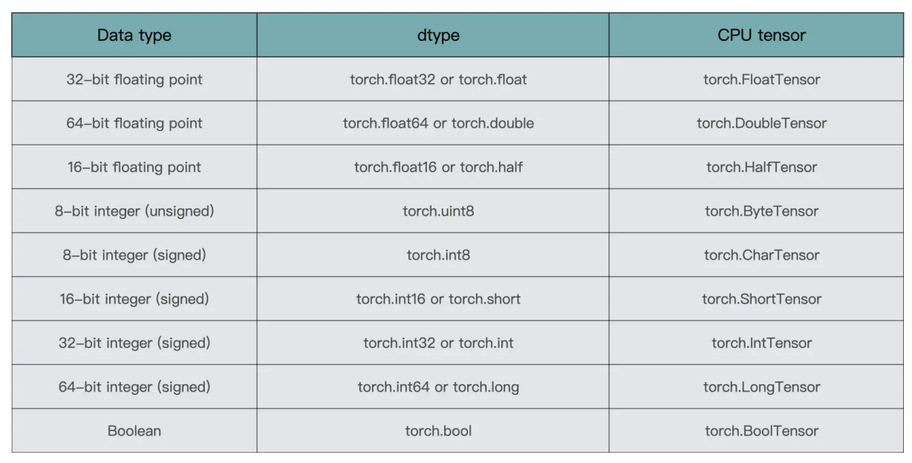
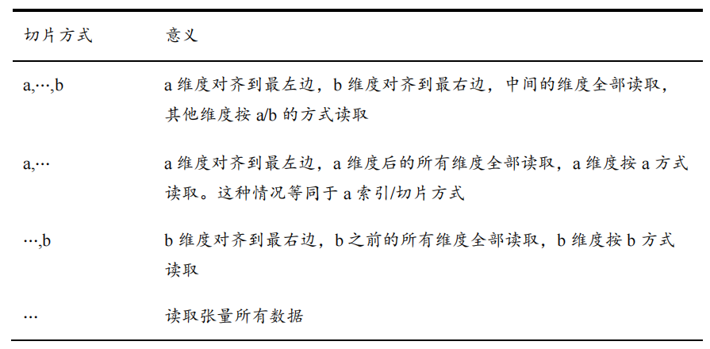
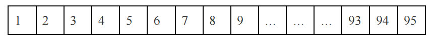
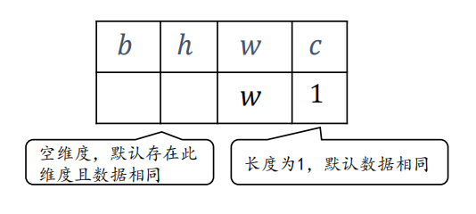
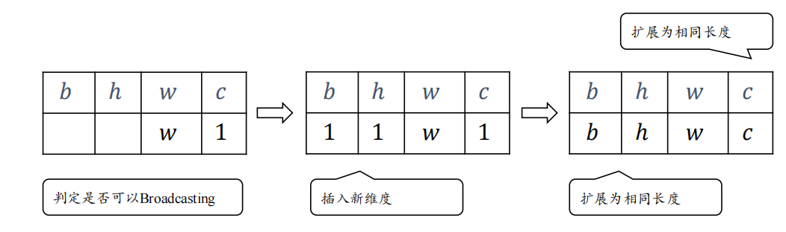

# 数据类型

## 数值类型
- 标量，也称 Scalar，是一个只有大小，没有方向的量，比如 1.8、e、10 等
- 向量，也称 Vector，是一个有大小也有方向的量，比如 (1,2,3,4) 等
- 矩阵，也称 Matrix，是多个向量合并在一起得到的量，比如[(1,2,3),(4,5,6)]等




- 张量，也称 Tensor,所有维度数 dim > 2 的数组统称为张量。张量的每个维度也叫作轴(Axis)，通常某个维度代表了特定的物理含义

在 PyTorch 中，为了表达方便，一般把标量、向量、矩阵也统称为张量，不作区分，需要根据张量的维度数或形状来自行判断。

```
import torch

t1 = torch.tensor(1.2)
print(t1)

t2 = torch.tensor([1, 2])
print(t2)

t3 = torch.tensor([[0,1],[2,3]])
print(t3)

t4 = torch.tensor([[[1,2],[3,4]],[[5,6],[7,8]]])
print(t4)
```
输出:
```
tensor(1.2000)
tensor([1, 2])
tensor([[0, 1],
        [2, 3]])
tensor([[[1, 2],
         [3, 4]],

        [[5, 6],
         [7, 8]]])
```

## 布尔类型
PyTorch 还支持布尔类型(Boolean，简称 bool)的张量。布尔类型的张量只需要传入 Python 语言的布尔类型数据，转换成 PyTorch 内部布尔型即可。

```
a = torch.tensor(True)
print(a)

b = torch.tensor([True,False, False])
print(b)
```
输出:
```
tensor(True)
tensor([ True, False, False])
```

# 数值精度
对于数值类型的张量，可以保存为不同字节长度的精度，较为常用的几种格式：



在创建张量时，可以通过 dtype 参数指定张量的保存精度。

精度过低时，可能导致数据溢出:
```
t1 = torch.tensor(123456789, dtype=torch.int16)
t2 = torch.tensor(123456789, dtype=torch.int32)
print(t1)
print(t2)
```
输出:
```
tensor(-13035, dtype=torch.int16)
tensor(123456789, dtype=torch.int32)
```

对于浮点数，高精度数据更加准确：
```
import numpy as np
t1 = torch.tensor(np.pi, dtype=torch.float32)
t2 = torch.tensor(np.pi, dtype=torch.float64)
print(f"{t1:.20f}")
print(f"{t2:.20f}")
```
输出:
```
3.14159274101257324219
3.14159265358979311600
```
## 类型转换
可以使用 `tensor.type` 转换数据类型
```
x = torch.tensor(np.pi, dtype=torch.float64)
if x.dtype != torch.float32:
    x = x.type(torch.float32)
print(x.dtype)
```
输出:
```
torch.float32
```

布尔类型与整型之间相互转换也是合法的:
```
t = torch.tensor([1, 0, -1])
t = t.type(torch.bool)
print(t)
print(t.dtype)
```
输出:
```
tensor([ True, False,  True])
torch.bool
```

对于常见张量类型的转换，可以通过 `long()、int()、float()、double()` 等函数便捷地转换到 `torch.int64、torch.int32、torch.float32、torch.float64` 精度:
```
t = torch.tensor(np.pi, dtype=torch.float64)
t = t.long().int()
print(t.dtype)
print(t)
```
输出:
```
torch.int32
tensor(3, dtype=torch.int32)
```

# 张量的创建

## 直接创建
```
torch.tensor(data, dtype=None, device=None,requires_grad=False)
```
- data: 传入的数据，可以是 `list、 tuple、numpy.ndarray、scalar` 等多种类型进行数据
- dtype: 数据类型
- device: 指定了数据要返回到的设备
- requires_grad: 说明当前量是否需要在计算中保留对应的梯度信息

从 `numpy.ndarray` 创建张量，`numpy.ndarray` 浮点数的默认数据类型是 `float64`:
```
array = np.array([1.,2.,3.])
t = torch.tensor(array)
print(t)

array[1] = 0
print(t)
print(array)
```
输出:
```
tensor([1., 2., 3.], dtype=torch.float64)
tensor([1., 2., 3.], dtype=torch.float64)
[1. 0. 3.]
```

## 创建全 0 或全 1 张量
通过 `torch.zeros()` 和 `torch.ones()` 即可创建任意形状，且内容全 0 或全 1 的张量。基本格式为:
```
torch.zeros(*size, dtype=None...)
torch.ones(*size, dtype=None...)
```

```
t1 = torch.zeros([3, 4])
print(t1)
t2 = torch.ones([2,3,2])
print(t2)
```
输出:
```
tensor([[0., 0., 0., 0.],
        [0., 0., 0., 0.],
        [0., 0., 0., 0.]])
tensor([[[1., 1.],
         [1., 1.],
         [1., 1.]],

        [[1., 1.],
         [1., 1.],
         [1., 1.]]])
```

也可以创建标量:
```
t1 = torch.zeros([])
t2 = torch.ones([])
print(t1)
print(t2)
print(type(t1))
print(t2.dtype)
```
输出:
```
tensor(0.)
tensor(1.)
<class 'torch.Tensor'>
torch.float32
```

通过 `torch.zeros_like, torch.ones_like` 可以方便地新建与某个张量形状一致，且内容为全 0 或全 1 的张量:
```
x = torch.tensor([[1.,2.],[3.,4.]])
t1 = torch.ones_like(x)
t2 = torch.zeros_like(x)
print(t1)
print(t2)
```
输出:
```
tensor([[1., 1.],
        [1., 1.]])
tensor([[0., 0.],
        [0., 0.]])
```

通过 `torch.eye` 可以创建单位矩阵，单位矩阵是指主对角线上的元素都为 1 的矩阵，基本格式为:
```
torch.eye(n, m=None...)
```
```
t1 = torch.eye(4)
print(t1)

t2 = torch.eye(4,3)
print(t2)
```
输出:
```
tensor([[1., 0., 0., 0.],
        [0., 1., 0., 0.],
        [0., 0., 1., 0.],
        [0., 0., 0., 1.]])
tensor([[1., 0., 0.],
        [0., 1., 0.],
        [0., 0., 1.],
        [0., 0., 0.]])
```

## 创建未初始化和指定值初始化的张量
有时需要创建未初始化的张量，可以使用 `torch.full` 函数实现:
```
t1 = torch.empty([2,3])
print(t1)
```

有时也需要全部初始化为某个自定义数值的张量，可以使用 `torch.full` 函数实现:
```
t1 = torch.full([], -1)
t2= torch.full([3,2],9)
print(t1)
print(t2)
```
输出:
```
tensor(-1)
tensor([[9, 9],
        [9, 9],
        [9, 9]])
```

## 创建已知分布的张量

`torch.randn` 可以创建均值为 0，标准差为 1 的正态分布的张量:
```
t1 = torch.randn([3,4,2])
print(t1)
```

`normal_` 可以创建均值为 mean，标注差为 stddev 的任意正态分布的张量:
```
t1 = torch.empty([2,3])
t1 = t1.normal_(mean=0.5, std=2)
print(t1)
```
`function_` 表示原地操作。

`torch.rand` 创建采样自 `[0,1)` 区间的均匀分布的张量：
``` 
t1 = torch.rand([3,3])
print(t1)
```

`torch.randint` 可以创建 `[low,high)` 均匀生成的随机整数:
```
t1 = torch.randint(1,20,[3,4])
print(t1)
```

`uniform_` 可以创建采样自 `[minval, maxval)` 区间分布的张量:
```
t1 = torch.empty([2,1])
t1 = t1.uniform_(3, 9)
print(t1)
```

更多分布的例子可以从 `torch.distributions` 子库中获取:
```
from torch.distributions import Bernoulli

dist = Bernoulli(torch.tensor(0.5))
print(dist.sample(torch.Size([8])))
```

## 创建序列

`torch.arange(start, end, step)` 可以创建 `[start, end)` 之间，步长为 `step` 整型序列，不包含 `end` 本身。
```
t1 = torch.arange(10)
print(t1)

t2 = torch.arange(2,8,3)
print(t2)

t3 = torch.arange(10,5,-1)
print(t3)
```
输出:
```
tensor([0, 1, 2, 3, 4, 5, 6, 7, 8, 9])
tensor([2, 5])
tensor([10,  9,  8,  7,  6])
```

`torch.range(start,end,step)` 可以创建 `[start, limit]`，步长为 `step` 的序，但包含 `end` 本身:
```
t1 = torch.range(1,5)
print(t1)

t2 = torch.range(2,8,3)
print(t2)

t3 = torch.range(10,5,-1)
print(t3)
```
输出:
```
tensor([1., 2., 3., 4., 5.])
tensor([2., 5., 8.])
tensor([10.,  9.,  8.,  7.,  6.,  5.])
```

# 张量的转换
## 张量与 python 数值类型之间的转换
可以将 python 的数值类型转换成 torch 的张量类型:
```
x = 1
t1 = torch.tensor(x)
print(t1)
print(t1.dtype)
```
输出:
```
tensor(1)
torch.int64
```

`item` 函数可以将张量转换成 python 的数值类型:
```
t1 = torch.tensor(1.4)
x = t1.item()
print(x)
print(type(x))
```
输出:
```
1.399999976158142
<class 'float'>
```

## 张量与 numpy 之间的转换
除了上文提打的使用 `numpy.nddarray` 直接创建张量外，也可以使用 `from_numpy` 函数创建张量，但是此时两者共享底层存储:
```
array = np.array([1,2,3])
t = torch.from_numpy(array)
print(t)
array[1] = 0
print(t)
```
输出:
```
tensor([1, 2, 3])
tensor([1, 0, 3])
```

从 `torch.tensor` 转换成 `numpy.ndarray` 可以调用 `numpy`，二者仍然共享底层的数据存储:
```
t = torch.tensor([1.,2.,3.])
array = t.numpy()
print(type(array))
array[0] = 8
print(t)
```
输出:
```
<class 'numpy.ndarray'>
tensor([8., 2., 3.])
```

## 张量与 python 的 list 之间的转换
可以直接从 python 的 list 类型创建张量类型：
```
lst = [1.1, 2.2, 3.3]
t1 = torch.tensor(lst)
print(t1)
print(t1.dtype)
```

张量转换成 python 的list 之前，需要先转换成 `numpy.ndarray` 类型，再使用 `tolist` 转换:
```
t1 = torch.tensor([1.,2.,3.])
lst = t1.numpy().tolist()
print(type(lst))
print(lst)
```
输出:
```
<class 'list'>
[1.0, 2.0, 3.0]
```


## CPU 和 GPU 张量转换
```
t1 = torch.tensor([1.,2.])
print(t1.device)
t1 = t1.cuda()
print(t1.device)
t1 = t1.cpu()
print(t1.device)
```
输出:
```
cpu
cuda:0
cpu
```

# 索引和切片

## 索引
张量支持基本的 `[𝑖][𝑗]` 标准索引方式，也支持通过逗号分隔索引号 `[i, j]` 的索引方式。

考虑输入`𝑿` 为 4 张 `32 × 32` 大小的彩色图片，`shape` 为 `[4,32,32,3]`:

```
X = torch.randint(0, 255, (4, 32, 32, 3))
```

读取第1张图片:
```
img1 = X[0]
print(img1.shape)
```
输出:
```
print(img1.shape)
```

读取第1张图片，第2行:
```
img1_2 = X[0, 1]
# 等价于 img1_2 = X[0][1]
print(img1_2.shape)
```
输出:
```
torch.Size([32, 3])
```

读取第1张图片，第2行，第3列:
```
img1_2_3 = X[0, 1, 2]
# 等价于 img1_2 = X[0][1][2]
print(img1_2_3.shape)
```
输出:
```
torch.Size([3])
```

读取第1张图片，第2行，第3列, G 通道:
```
img1_2_3_G = X[0, 1, 2, 1]
print(img1_2_3_G)
```

## 切片

通过 `start: end: step` 切片方式可以方便地提取一段数据，其中 `start` 为开始读取位置的索引，`end` 为结束读取位置的索引(不包含 `end` 位)，`step` 为采样步长。

```
X = torch.randint(0, 255, (4, 32, 32, 3))
# 选取前两张图片
a = X[1:3]
print(a.shape)

# 选取第一张图片
a = X[0, ::]
print(a.shape)

# 间隔采样
a = X[:,::2,::2,:]
print(a.shape)
```
输出:
```
torch.Size([2, 32, 32, 3])
torch.Size([32, 32, 3])
torch.Size([4, 16, 16, 3])
```

`start: end: step` 切片的简写方式:
- 其中从第一个元素读取时 `start` 可以省略，即 `start=0` 是可以省略
- 取到最后一个元素时 `end` 可以省略
- 步长为 1 时 `step` 可以省略
- `::` 表示读取所有元素
- `:` 表示读取所有元素

为了避免出现像 `[: , : , : ,1]` 这样过多冒号的情况，可以使用 `⋯` 符号表示取多个维度上所有的数据，其中维度的数量需根据规则自动推断：当切片方式出现 `⋯` 符号时，`⋯` 符号左边的维度将自动对齐到最左边，`⋯` 符号右边的维度将自动对齐到最右边，此时系统再自动推断 `⋯` 符号代表的维度数量。



```
X = torch.randint(0, 255, (4, 32, 32, 3))

# 读取前两张图片的 G、B 通道
a = X[0:2,...,1:]
print(a.shape)

# 读取最后两张图片
a = X[:2,...]
print(a.shape)

# 读取R、G通道数据
a = X[...,:2]
print(a.shape)
```
输出:
```
torch.Size([2, 32, 32, 2])
torch.Size([2, 32, 32, 3])
torch.Size([4, 32, 32, 2])
```

# 张量的常用操作
## 获取张量形状
可以使用 `shape` 或 `size()` 来获取。两者的不同之处在于，`shape` 是 `torch.tensor` 的一个属性，而 `size()` 则是一个 `torch.tensor` 拥有的方法。
```
a = torch.zeros([2, 3, 4])
print(a.shape)
print(a.size())
```
输出:
```
torch.Size([2, 3, 4])
torch.Size([2, 3, 4])
```

可以使用 `ndim` 属性获取张量的维数：
```
a = torch.zeros([2, 3, 4])
print(a.ndim)
```
输出：
```
3
```

可以使用 `numel()` 函数直接统计元素数量:
```
a = torch.zeros([2, 3, 4])
print(a.numel())
```
输出：
```
24
```

## 改变视图
张量的视图就是人们理解张量的方式，比如 `shape` 为 `[2,3,4,4]` 的张量，从逻辑上可以理解为 2 张图片，每张图片 4 行 4 列，每个位置有 RGB 3 个通道的数据。
张量的存储体现在张量在内存上保存为一段连续的内存区域，它类似于向量的一维结构，无法表达高维数据结构。

因此对于同样的存储，可以有不同的维度理解方式，比如上述张量，可以在不改变张量的存储的条件下，理解为:
- 2 个样本，每个样本的特征是长度 48 的向量
- 4 个样本，每个样本的特征是长度为 24 的向量
- 1 个样本，这个样本的特征长度是 96 的向量

同一个存储，从不同的角度观察数据，可以产生不同的视图，这就是存储与视图的关系。视图的产生是非常灵活的，但需要人为保证是合理且合法的。

`reshape()` 和 `view()` 函数可以改变张量的视图:
```
x = torch.arange(96)
a = x.reshape(4, 24)
print(a.shape)
a = x.reshape(2, 3, 4, 4)
print(a.shape)
a = x.view(96, -1)
print(a.shape)
a = x.view(12, -1, 4)
print(a.shape)
```
输出:
```
torch.Size([4, 24])
torch.Size([2, 3, 4, 4])
torch.Size([96, 1])
torch.Size([12, 2, 4])
```

如果轴上出现 `-1`，则表示当前轴上长度需要根据张量总元素不变的合法性原则自动推导。

改变张量的视图仅仅是改变了张量的理解方式，并不会改变张量的存储顺序，底层的存储始终都是按照一维线性存储的：



如果新的逻辑结构不需要改变数据的存储方式，就可以节省大量计算资源，这也是改变视图操作的优势，否则改变视图操作就是非法的。

初始视图 `[𝑏, 𝑐, ℎ, w]`，并按此写入，如果转换为视图 `[𝑏, w, ℎ, 𝑐]` 而不改变底层数据存储时将导致数据混乱。因此改变视图时，必须始终记住张量的存储顺序，新视图的维度顺序不能与存储顺序相悖，否则需要通过交换维度操作将存储顺序同步过来。

## 交换维度
保持维度存储顺序不变的条件下，仅仅改变张量的理解方式是不够的，有时需要直接调整张量的存储顺序，即交换维度(Transpose)操作。通过交换维度操作，改变了张量的存储顺序，同时也改变了张量的视图。

`permute()` 函数可以用于交换维度:
```
x = torch.randn(2, 3, 28, 28)
print(x.shape)
a = x.permute((0, 2, 3, 1))
print(a.shape)
```
输出:
```
torch.Size([2, 3, 28, 28])
torch.Size([2, 28, 28, 3])
```
特别地，如果仅两个维度的顺序互换，还可以使用 `transpose()` 函数实现:
```
x = torch.randn(2, 28, 28, 3)
a = x.transpose(1, 3)
print(a.shape)
```
输出:
```
torch.Size([2, 3, 28, 28])
```

更特别地，对于矩阵装置操作，可以使用 `t()` 函数完成:
```
x = torch.randn(3, 4)
a = x.t()
print(a.shape)
```
输出:
```
torch.Size([4, 3])
```

需要注意的是，完成维度交换操作后，张量的存储顺序已发生改变，视图也随之改变，后续的所有操作必须基于新的存续顺序和视图进行。相对于改变视图操作，维度交换操作的计算代价更高。


## 增删维度
增加维度 增加一个长度为 1 的维度相当于给原有的数据添加一个新维度的概念，维度长度为 1，存储并不需要改变，仅仅是改变数据的理解方式，因此它其实可以理解为改变视图的一种特殊方式。

通过 `torch.unsqueeze(x, dim)` 可以用于增加维度:
- dim 为非负时，表示在当前维度之前插入一个新维度
- dim 为负时，表示当前维度之后插入一个新的维度

```
x = torch.randint(0, 10, [28, 28])
print(x.shape)
x = torch.unsqueeze(x, dim=0)
print(x.shape)
x = torch.unsqueeze(x, dim=2)
print(x.shape)
x = torch.unsqueeze(x, dim=-1)
print(x.shape)
```
输出:
```
torch.Size([28, 28])
torch.Size([1, 28, 28])
torch.Size([1, 28, 1, 28])
torch.Size([1, 28, 1, 28, 1])
```

删除维度是增加维度的逆操作，与增加维度一样，删除维度只能删除长度为 1 的维度，也不会改变张量的存储。可以通过 `torch.squeeze(x, dim)` 函数来实现:
```
x = torch.randint(0, 10, [1, 28, 1, 28, 1, 1])
print(x.shape)
x = torch.squeeze(x,dim=0)
print(x.shape)
x = torch.squeeze(x, dim=-1)
print(x.shape)
x = torch.squeeze(x)
print(x.shape)
```
输出:
```
torch.Size([1, 28, 1, 28, 1, 1])
torch.Size([28, 1, 28, 1, 1])
torch.Size([28, 1, 28, 1])
torch.Size([28, 28])
```
特别地，如果不指定维度参数 `dim`，即 `torch.squeeze(x)`，那么它会默认删除所有长度为 1 的维度。

## 复制数据
可以通过 `repeat(repeats)` 函数完成数据在各个维度上的复制操作，参数 `repeats` 分别指定了每个维度上的复制倍数，对应位置为 1 表明不复制，为 2 表明新长度为原来长度的 2 倍，即数据复制一份，以此类推。

```
a = torch.arange(24).reshape([2, 3, 4])
print(a.shape)
a = a.repeat([1, 3, 2])
print(a.shape)
```
输出:
```
torch.Size([2, 3, 4])
torch.Size([2, 9, 8])
```

需要注意的是，`repeat()` 函数会创建一个新的内存区来保存复制后的张量，由于复制操作涉及大量数据的读写 IO 运算，计算代价相对较高，因此数据复制操作较为昂贵。


## Broadcasting 机制
Broadcasting 称为广播机制(或自动扩展机制)，它是一种轻量级的张量复制手段，在逻辑上扩展张量数据的形状，但是只会在需要时才会执行实际存储复制操作。对于大部分场景，Broadcasting 机制都能通过优化手段避免实际复制数据而完成逻辑运算，从而相对于上一节的 repeat 函数，减少了大量计算代价，但是计算逻辑完全一样。

对于所有长度为 1 的维度，Broadcasting 的效果和 repeat 函数一样，都能在此维度上逻辑复制数据若干份，区别在于 repeat 函数会创建一片新的内存空间，执行 IO 复制操作，并保存复制后的张量数据，而 Broadcasting 机制并不会立即复制数据，它会在逻辑上改变张量的形状，使得视图上变成了复制后的形状，从而可以继续进行下一步运算。Broadcasting 机制会通过深度学习框架的优化手段避免实际复制数据而完成逻辑运算，至于怎么实现的用户不必关心。

```
a = torch.randn([2,3,3,4])
b = torch.randn([3,1])
c = a + b # 维度不同的数据仍然合法计算
print(c.shape)
```
输出:
```
torch.Size([2, 3, 3, 4])
```

上面的计算维度不同的张量之间计算是合法的就是利用了广播机制，Broadcasting 机制的核心思想是普适性，即同一份数据能普遍适合于其他维度。在验证
普适性之前，需要先将张量 shape 靠右对齐，然后进行普适性判断：
- 对于长度为 1 的维度，默认这个数据普遍适合于当前维度的其他位置
- 对于不存在的维度，则在增加新维度后默认当前数据也是普适于新维度的，从而可以扩展为更多维度数、任意长度的张量形状



广播机制的变换过程可以表示为:



相对于昂贵的 `repeat` 操作来说，`expand` 操作几乎是零消耗的，甚至用户都不需要显式调用 `expand` 操作:
```
a = torch.arange(32).view(32, 1)
# 扩展为 4D 张量
a = a.expand(2,32,32,3)
print(a.shape)
```
在进行张量运算时，有些运算在处理不同 `shape` 的张量时，会隐式地自动触发 Broadcasting 机制，如 `+、-、*、/` 等运算符等。


# 数学运算
## 加、减、乘、除运算
加、减、乘、除是最基本的数学运算，分别通过 `torch.add、torch.sub、torch.mul、torch.div` 函数实现，PyTorch 已经重载了 `+、 − 、 ∗ 、/` 运算符。

整除和余除也是常见的数学运算之一，分别通过 `//` 和 `%` 运算符实现。

```
a = torch.arange(5)
b = torch.tensor(2)
print(a)
print(a + b)
print(a - b)
print(a * b)
print(a / b)
print(a // b)
print(a % b)
```
输出:
```
tensor([0, 1, 2, 3, 4])
tensor([2, 3, 4, 5, 6])
tensor([-2, -1,  0,  1,  2])
tensor([0, 2, 4, 6, 8])
tensor([0.0000, 0.5000, 1.0000, 1.5000, 2.0000])
tensor([0, 0, 1, 1, 2])
tensor([0, 1, 0, 1, 0])
```

## 乘方运算
通过 `torch.pow(x, a)` 可以方便地完成 $x^a$ 乘方计算，也可以通过运算符 `**` 完成乘方计算:
```
x = torch.arange(4)
print(torch.pow(x, 2))
print(x**3)
```
输出:
```
tensor([0, 1, 4, 9])
tensor([ 0,  1,  8, 27])
```

设置指数为 $\frac{1}{a}$ 可以用于 $\sqrt[a]{x} $ 计算:
```
x = torch.arange(4) ** 3
x = x ** (1/3)
print(x)
```
输出:
```
tensor([0., 1., 2., 3.])
```

特别地，对于常见的平方和平方根运算，可以使用 `square()` 和 `sqrt()` 实现:
```
x = torch.arange(4)
x = torch.square(x)
print(x)
x = torch.sqrt(x)
print(x)
```
输出:
```
tensor([0, 1, 4, 9])
tensor([0., 1., 2., 3.])
```

## 指数和对数运算
通过 `torch.pow(a, x)` 或者 `**` 运算符也可以方便地实现指数运算 $a^{x}$:
```
x = torch.arange(5)
print(2 ** x)
```
输出:
```
tensor([ 1,  2,  4,  8, 16])
```

特别地，对于自然指数 $e^{x}$ 可以通过 `exp()` 函数实现:
```
x = torch.arange(5)
print(torch.exp(x))
```
输出:
```
tensor([ 1.0000,  2.7183,  7.3891, 20.0855, 54.5981])
```

对数运算，例如常见的: $\log_{e}{x}$，$\log_{2}{x}$，$\log_{10}{x}$ 等，可以直接调用 `torch.log()、torch.log2()、torch.log10()` 等函数实现:
```
x = torch.arange(1,5)
print(torch.log(x))
print(torch.log2(x))
print(torch.log10(x))
```
输出:
```
tensor([0.0000, 0.6931, 1.0986, 1.3863])
tensor([0.0000, 1.0000, 1.5850, 2.0000])
tensor([0.0000, 0.3010, 0.4771, 0.6021])
```

如果希望计算其它底数的对数，可以根据对数的换底公式：
$$
\log_{a}{x}= \frac{\log_{e}{x}}{\log_{e}{a}} 
$$
进行计算:
```
x = torch.arange(1,5)
print(torch.log(torch.tensor(100))/torch.log(torch.tensor(10)))
```
输出:
```
tensor(2.)
```

## 矩阵相乘运算
通过 `@` 运算符可以方便地实现矩阵相乘，还可以通过 `torch.matmul(a, b)` 函数实现。

需要注意的是，PyTorch 中的矩阵相乘可以使用批量方式，也就是张量 𝑨 和 𝑩 的维度数可以大于 2。当张量 𝑨 和 𝑩 维度数大于 2 时，PyTorch 会默认选择  𝑨和 𝑩 的最后两个维度进行矩阵相乘，前面所有的维度都视作 Batch 维度。

根据矩阵相乘的定义，矩阵 𝑨 和 𝑩 能够完成矩阵相乘的条件是，𝑨 的倒数第一个维度长度(列)和 𝑩 的倒数第二个维度长度(行)必须相等。

```
a = torch.randn([2, 3, 32, 28])
b = torch.randn([2, 3, 28, 64])
c = a @ b
print(c.shape)
```
输出:
```
torch.Size([2, 3, 32, 64])
```

矩阵相乘函数同样支持自动 Broadcasting 机制，例如:
```
a = torch.randn(4, 28, 32)
b = torch.randn(32,16)
c = a @ b
print(c.shape)
```
输出:
```
torch.Size([4, 28, 16])
```

## 合并与分割
### 合并
张量的合并可以使用拼接(Concatenate)和堆叠(Stack)操作实现
- 拼接操作并不会产生新的维度，仅在现有的维度上合并
- 堆叠会创建新维度并合并数据

拼接 在 PyTorch 中，可以通过 `torch.cat(tensors, dim)` 函数拼接张量，其中参数 tensors 保存了所有需要合并的张量 `List，dim` 参数指定需要合并的维度索引。
```
a = torch.randn([2,3,9])
b = torch.randn([2,3,8])
c = torch.cat([a,b], dim=2)
print(c.shape)
```
输出:
```
torch.Size([2, 3, 17])
```
从语法上来说，拼接合并操作可以在任意的维度上进行，唯一的约束是所有非合并维度的长度必须一致。

```
a = torch.randn([4,32,8])
b = torch.randn([6,35,8])
torch.cat([a,b], dim=0) 
```
输出:
```
RuntimeError: Sizes of tensors must match except in dimension 0. Expected size 32 but got size 35 for tensor number 1 in the list.
```

拼接操作直接在现有维度上合并数据，并不会创建新的维度。如果在合并数据时，希望创建一个新的维度，则需要使用堆叠操作。

使用 `torch.stack(tensors, dim)` 可以以堆叠方式合并多个张量，通过 tensors 列表表示，参数 `dim` 指定新维度插入的位置，`dim` 的用法与 `torch.unsqueeze` 函数的一致，当 `dim ≥ 0` 时，在 `dim` 之前插入；当 `dim < 0` 时，在 `dim` 之后插入新维度：
```
a = torch.randn([4, 3])
b = torch.randn([4,3])
c= torch.stack([a,b])
print(c.shape)
c= torch.stack([a,b],dim=1)
print(c.shape)
c= torch.stack([a,b],dim=-1)
print(c.shape)
```
输出:
```
torch.Size([2, 4, 3])
torch.Size([4, 2, 3])
torch.Size([4, 3, 2])
```
Stack 操作也需要满足张量堆叠合并的条件，它需要所有待合并的张量 shape 完全一致才可合并。张量 shape 不一致时进行堆叠合并发生的错误:
```
a = torch.randn([35,4])
b = torch.randn([35,8])
torch.stack([a,b], dim=-1)
```
输出:
```
RuntimeError: stack expects each tensor to be equal size, but got [35, 4] at entry 0 and [35, 8] at entry 1
```

### 分割
合并操作的逆过程就是分割，即将一个张量拆分为多个张量。

通过 `torch.split(x, split_size_or_sections, dim)` 可以完成张量的分割操作，参数意义定义如下:
- `x`: 待分割张量
- `split_size_or_sections`: 切割方案。当 `split_size_or_sections` 为单个数值时，表示每份的长度，当 `split_size_or_sections` 为 List 时，List 的每个元素表示每份的长度
- `dim`：指定待分割的维度索引号
```
x = torch.randn([10, 35, 8])

a = torch.split(x, 2, dim=0)
print(len(a))
print(a[0].shape)

a = torch.split(x, 3, dim=0)
print(len(a))
print(a[-1].shape)

a = torch.split(x, [2, 3, 3], dim=2)
print(len(a))
print(a[0].shape)
```
输出:
```
5
torch.Size([2, 35, 8])
4
torch.Size([1, 35, 8])
3
torch.Size([10, 35, 2])
```

除了 `split` 函数可以实现张量分割外，PyTorch 还提供了另一个函数 `torch.chunk(x,chunks,dim)`。他的用法与 `torch.split` 非常类似，区别在于 `chunk` 函数的参数 `chunks` 指定了切割份数，而 `split` 函数的参数 `split_size_or_sections` 则是每份长度。

```
x = torch.randn([10, 35, 8])

a = torch.chunk(x, 5, dim=0)
print(len(a))
print(a[-1].shape)

a = torch.chunk(x, 3, dim=-1)
print(len(a))
print(a[-1].shape)
```
输出:
```
5
torch.Size([2, 35, 8])
3
torch.Size([10, 35, 2])
```

此外，`torch.unbind(x, dim)` 函数也具有分割张量的功能，它沿着 `dim` 维度将张量切分为长度为 1 每份。
```
```
输出:
```
x = torch.randn([10, 35, 8])

a = torch.unbind(x, dim=0)
print(len(a))
print(a[0].shape)
```
输出:
```
10
torch.Size([35, 8])
```

## 数据统计

### 向量范数

### 最值、均值、和


## 张量比较


## 填充与复制
### 填充


### 复制

## 采样

### 索引采样


### 掩码采样 


### Gather 采样


### Where 采样


## Scatter 写入


## Meshgrid 网格


