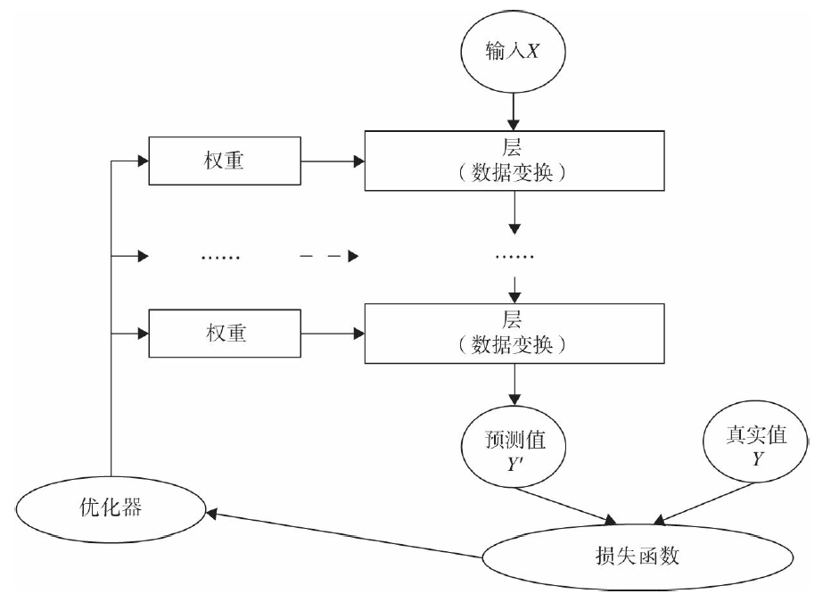

# 神经网络核心组件

神经网络核心组件有:
- 层：神经网络的基本结构，将输入张量转换为输出张量
- 模型：层构成的网络
- 损失函数：参数学习的目标函数，通过最小化损失函数来学习各种参数
- 优化器：如何使损失函数最小，这就涉及优化器




这些核心组件不是独立的，它们之间，以及它们与神经网络其他组件之间有密切关系:

- 多个层链接在一起构成一个模型或网络，输入数据通过这个模型转换为预测值
- 损失函数把预测值与真实值进行比较，得到损失值（损失值可以是距离、概率值等），该损失值用于衡量预测值与目标结果的匹配或相似程度
- 优化器利用损失值更新权重参数，从而使损失值越来越小
- 这是一个循环过程，当损失值达到一个阀值或循环次数到达指定次数，循环结束

# Pytorch 神经网络工具箱

PyTorch实现神经网络主要工具及相互关系:


## nn.Module 和 nn.functional

### nn.Module
- `nn.Module` 是 `nn` 的一个核心数据结构，它可以是神经网络的某个层(Layer)，也可以是包含多层的神经网络
- 在实际使用中，最常见的做法是继承 `nn.Module`，生成自己的网络/层
- `nn` 中已实现了绝大多数层，包括全连接层、损失层、激活层、卷积层、循环层等，这些层都是 `nn.Module` 的子类
- 基于 `nn.Module` 实现的层能够自动检测到自己的 `Parameter`，并将其作为学习参数，且针对 GPU 运行进行了优化
- 继承自 `nn.Module` 中层，一般命名为: `nn.Xxx`(第一个是大写)，如 `nn.Linear、nn.Conv2d、nn.CrossEntropyLoss` 等

### nn.functional
`nn` 中的大多数层(Layer)在 `functional` 中都有与之对应的函数，其名称一般为 `nn.funtional.xxx，如nn.funtional.linear、nn.funtional.conv2d、nn.funtional.cross_entropy` 等。

从功能来说两者相当，基于 `nn.Moudle` 能实现的层，使用 `nn.funtional` 也可实现，反之亦然，而且性能方面两者也没有太大差异。不过在具体使用时，两者还是有区别，主要区别如下：
- `nn.Xxx` 继承于 `nn.Module`，`nn.Xxx` 需要先实例化并传入参数，然后以函数调用的方式调用实例化的对象并传入输入数据。它能够很好地与 `nn.Sequential` 结合使用，而 `nn.functional.xxx` 无法与 `nn.Sequential` 结合使用
- `nn.Xxx` 不需要自己定义和管理 `weight、bias` 参数；而 `nn.functional.xxx` 需要自己定义 `weight、bias` 参数，每次调用的时候都需要手动传入 `weight、bias` 等参数，不利于代码复用
- `Dropout` 操作在训练和测试阶段是有区别的，使用 `nn.Xxx` 方式定义 `Dropout`，在调用 `model.eval()` 之后，自动实现状态的转换，而使用 `nn.functional.xxx` 却无此功能

总的来说，两种功能都是相同的，但 PyTorch 官方推荐：具有学习参数的（例如，`conv2d,linear,batch_norm`)采用 `nn.Xxx` 方式。没有学习参数的（例如，`maxpool、loss func、activation func`）等根据个人选择使用 `nn.functional.xxx` 或者 `nn.Xxx` 方式。

## 优化器
PyTorch 常用的优化方法都封装在 `torch.optim` 里面，其设计很灵活，可以扩展为自定义的优化方法。所有的优化方法都是继承了基类 `optim.Optimizer`，并实现了自己的优化步骤。最常用的优化算法就是梯度下降法及其各种变种。

使用优化器的一般步骤为:
- 建立优化器实例
导入 `optim` 模块，实例化 SGD 优化器，这里使用动量参数 `momentum`，是 SGD 的改进版，效果一般比不使用动量规则的要好:
```
import torch.optim as optim
optimizer = optim.SGD(model.parameters(), lr=lr, momentum=momentum)
```

- 前向传播
把输入数据传入神经网络 `Net` 实例化对象 `model` 中，自动执行 `forward` 函数，得到 `out` 输出值，然后用 `out` 与标记`label` 计算损失值 `loss`:
```
out = model(img)
loss = criterion(out, label)
```

- 清空梯度
缺省情况梯度是累加的，在梯度反向传播前，先需把梯度清零:
```
optimizer.zero_grad()
```

- 反向传播
基于损失值，把梯度进行反向传播:
```
loss.backward()
```

- 更新参数
基于当前梯度（存储在参数的 `.grad` 属性中）更新参数:
```
optimizer.step()
```

# Pytorch 神经网络实战


